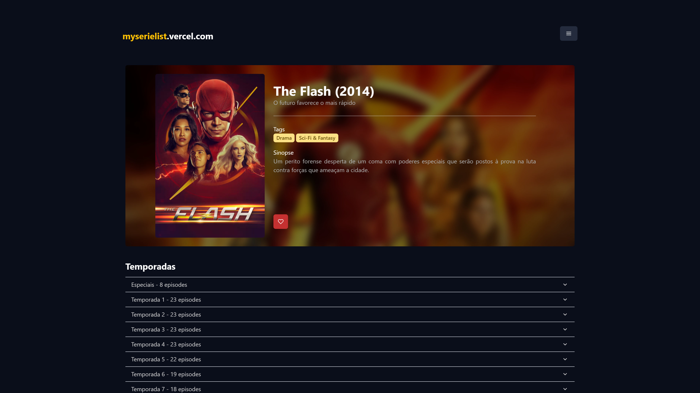
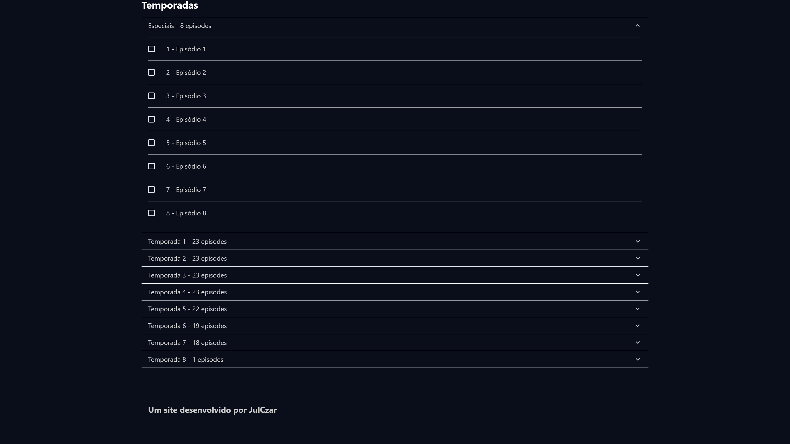
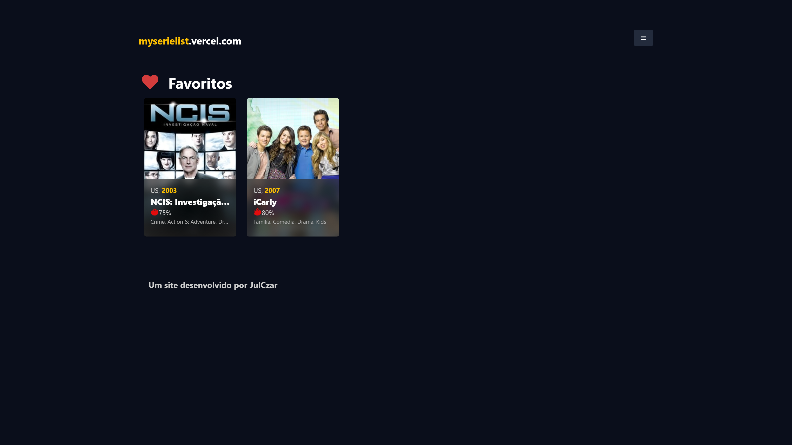

## [My Serie List](https://myserielist.vercel.app/)

My Serie List é um serviço que utiliza a api do [The Movie DB](https://www.themoviedb.org/) para listar os seriados mais populares e manter o controle sobre os episódios já assistidos.

Para usar é simples, basta buscar o seriado com a ajuda de nossos filtros, marcar os episódios assistidos, o histórico será mantido junto ao navegador, então lembre-se de exportá-lo caso deseje salvar o progresso antes de formatar o computador ou trocar de navegador.

## Uso

O aplicativo está disponível para visualização a partir do link: [https://myserielist.vercel.app/](https://myserielist.vercel.app/)

## Dependências utilizadas no projeto:

- [Axios](https://axios-http.com/docs/intro)
- [ChakraUI](https://chakra-ui.com/docs/getting-started)
- [Next](https://nextjs.org/)
- [React](https://pt-br.reactjs.org/)
- [React Select](https://react-select.com/home)
- [Typescript](https://www.typescriptlang.org/)

API: [https://api.themoviedb.org/3](https://api.themoviedb.org/3)

Docs: [https://developers.themoviedb.org/3/getting-started/introduction](https://developers.themoviedb.org/3/getting-started/introduction)

Design: [https://dribbble.com/shots/9956355](https://dribbble.com/shots/9956355)

## Instruções para rodar o projeto localmente

Requerimentos:

- Node 14.x+

Clone o projeto em sua maquina, pelo terminal navegue até o repositório clonado e instale as dependências utilizando `npm install` ou caso prefira `yarn install`

Em seguida, crie um arquivo nomeado `.env` e adicione a chave `API_KEY` com o token para a API v3 do [The Movie DB](https://www.themoviedb.org/)

Para iniciar o projeto execute os comandos:

```bash
npm run build;
# ou yarn build
npm run start;
# ou yarn start
```

Abra o navegador e insira [http://localhost:3000](http://localhost:3000) (\*) na barra de endereços para acessar o projeto localmente

Alternativamente, é também possível rodar o projeto utilizando:

```bash
npm run dev;
# ou yarn dev
```

reduzindo o número de comandos, porém esse comando executa uma versão de desenvolvimento do projeto, com hot-reload (\*\*) ativado, o que irá exigir mais de seu computador

### Observações:

\*A porta padrão da aplicação é a 3000, mas caso algum serviço em seu computador já esteja utilizando tal porta, outra será alocada para a aplicação, atente-se ao terminal para verificar a porta em uso.

\*\*Reinicialização do servidor automática após alterações do código

## Screenshots





